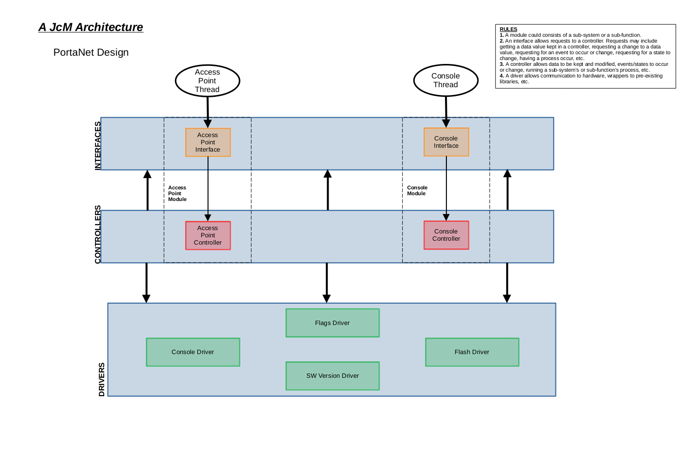

# *TABLE OF CONTENTS*
- [Introduction](#introduction)
- [Hardware](#hardware)
    - [Hardware General](#hardware-general)
    - [Hardware Tools](#hardware-tools)
    - [Schematic](#schematic)
    - [PCB Layout](#pcb-layout)
    - [BOM](#bom)
- [Software](#software)
    - [Software General](#software-general)
    - [Software Tools](#software-tools)
    - [Architecture](#architecture)
    - [Building](#building--flashing)
- [How to Use](#how-to-use)
    - [Use General](#use-general)
    - [PuTTy](#putty)
    - [Console Commands](#console-commands)
 
 
 

# *INTRODUCTION*
The PortaNet is a wifi access point (AP) using the Espressif ESP32-C3FH4 microcontroller. The PortaNet holds the shape and connection types of a typical USB stick. The AP's settings can be modified via a serial console. At this point PuTTy is the only tested terminal emulator software for use with PortaNet.

 

 
 
 

# *HARDWARE*
### Hardware General
The critical component consists of the [Espressif ESP32-C3FH4](https://www.espressif.com/en/products/socs/esp32-c3). The ESP32-C3FH4 microcontroller is a ESP32-C3 variant with 4MB internal flash. Simply buying the "normal" ESP32-C3 variant will not suffice due to the lack of internal flash.

The design utilizes a 50 $\Omega$ impedance, 2.4 GHz wifi antenna. Antennas such as [this](https://www.amazon.com/gp/product/B07D1Z3W7T/ref=ppx_yo_dt_b_search_asin_title?ie=UTF8&psc=1) and [this](https://www.amazon.com/gp/product/B0991PKTDL/ref=ppx_yo_dt_b_search_asin_title?ie=UTF8&psc=1) have worked successfully. There is an unused $\pi$-matching circuit that could aid in supporting other antennas.

### Hardware Tools
KiCad v6 was utilized as the EDA tool. The KiCad project can be found in the [hardware directory](hardware/kicad/PortaNet/). Additionally my [KiCad Library](http://192.168.1.19:3000/JMa/KiCad_Library) may contain needed symbols and footprints that the project references.

### Schematic
The current schematic can be seen [here](hardware/kicad/PortaNet_SCH.pdf). 

On page 2 of the schematic, the only oddity worth explaining is the NC of C2. Having C2 installed results in the GPIO9 (pin 15) being pulled low. Resulting in the firmware getting stuck in the bootloader.

On page 3 of the schematic, lives the unused $\pi$-matching circuit labeled `Antenna`. If the $\pi$-matching circuit does not want to be used, then `L1` should be shorted with a 0 $\Omega$ resistor.

On page 3 also lives the `Crystal` section. While the load capacitors are labeled 7pF, 8pF caps work with no issues thus far. 

### PCB Layout
The board layout consists of 4 layers, with components on both the top and bottom layers. 

The layer structure consists of the top layer being a signal layer, the second and third layer being GND layers, and the bottom layer being a PWR/signal layer. The top layer or layer 1 of the board is structured to isolate noise sources from other hardware sections. The sub-circuits on the top layer are split into PWR/USB, microcontroller (uC), crystal (XTAL), and radio frequency (RF) sections. GND traces with vias surround the RF and XTAL sections of the top layer.

### BOM
The BOM can be found [here](hardware/kicad/PortaNet/PortaNet.csv). As well as a copy and paste is below. It is again important to note that **the ESP32-C3 part purchased must be a part that contains internal flash.**

| Ref               | Qnty | Value            | Cmp name         | Footprint                                                       |
|-------------------|------|------------------|------------------|-----------------------------------------------------------------|
| C1,               | 1    | 1uF              | C_Small          | Capacitor_SMD:C_0603_1608Metric                                 |
| C2,               | 1    | NC               | C_Small          | Capacitor_SMD:C_0603_1608Metric                                 |
| C3, C7, C13,      | 3    | 0.1uF            | C_Small          | Capacitor_SMD:C_0603_1608Metric                                 |
| C4, C8, C10, C14, | 4    | 10uF             | C_Small          | Capacitor_SMD:C_0603_1608Metric                                 |
| C5, C6,           | 2    | TBD              | C_Small          | Capacitor_SMD:C_0603_1608Metric                                 |
| C9,               | 1    | .1uF             | C_Small          | Capacitor_SMD:C_0603_1608Metric                                 |
| C11, C12,         | 2    | 7pF              | C_Small          | Capacitor_SMD:C_0603_1608Metric                                 |
| D1,               | 1    | DSS13UTR         | D_Schottky       | Diode_SMD:D_SOD-123F                                            |
| J1,               | 1    | SMA              | Conn_Coaxial     | Connector_Coaxial:SMA_Amphenol_132134_Vertical                  |
| J2,               | 1    | Molex 0480370001 | USB_A            | JoesFootprints:Molex_0480370001                                 |
| L1,               | 1    | TBD              | L                | Inductor_SMD:L_0805_2012Metric_Pad1.15x1.40mm_HandSolder        |
| R1, R2, R3,       | 3    | 10k              | R_Small_US       | Resistor_SMD:R_0805_2012Metric                                  |
| R4, R5,           | 2    | 22               | R_Small_US       | Resistor_SMD:R_0805_2012Metric                                  |
| SW1,              | 1    | 434133025816     | SW_SPST          | Button_Switch_SMD:SW_Push_1P1T_NO_Vertical_Wuerth_434133025816  |
| U1,               | 1    | ESP32-C3         | ESP32-C3         | Package_DFN_QFN:QFN-32-1EP_5x5mm_P0.5mm_EP3.3x3.3mm_ThermalVias |
| U2,               | 1    | AP2114HA-3.3TRG1 | AP2114HA-3.3TRG1 | Package_TO_SOT_SMD:SOT-223-3_TabPin2                            |
| Y1,               | 1    | FL400WFQA1       | Crystal_GND24    | Crystal:Crystal_SMD_3225-4Pin_3.2x2.5mm                         |

 
 
 

# *SOFTWARE*
### Software General
The firmware is written in C using [Espressif's IOT Development Framework (ESP-IDF)](https://www.espressif.com/en/products/sdks/esp-idf#:~:text=ESP%2DIDF%20is%20Espressif's%20official,as%20C%20and%20C%2B%2B.). The software utilizes [FreeRTOS](https://www.freertos.org/) as part of the ESP-IDF as well. 

### Software Tools
The software used `ESP-IDF v5.0-dev-3032-g7e71c0cff2-dirty`. The ESP-IDF can be found [here](https://github.com/espressif/esp-idf).

### Architecture
The software utilizes an RTOS variation of [A JcM Architecture](http://192.168.1.19:3000/JMa/JcmArch). Architecture formats can be seen [here](firmware/)

Two threads exists in the software. The first thread, which has the highest priority, is the `Access Point Thread`. The second thread, which has a lower priority compared to the `Access Point Thread`, is the `Console Thread`. The `Access Point Thread` is controlling the wifi soft-AP and the `Console Thread` is controlling the serial console processes that make requests to the `Access Point Interface`. 

### Building & Flashing
1. Clone the repo 
`git clone http://192.168.1.19:3000/JMa/PortaNet.git`

2. Enter the firmware folder 
`cd PortaNet/firmware/PortaNet/`

3. Source the ESP-IDF export script from proper location 
example: `. ~/esp-idf/export.sh`

4. Ensure the target is set to the ESP32-C3 
`idf.py set-target esp32c3`

5. Build the project 
`idf.py build`

6. Flash the device 
`idf.py -p PORT flash`

 

If issues arise, Espressif has good documentation located [here](https://docs.espressif.com/projects/esp-idf/en/latest/esp32c3/get-started/linux-macos-setup.html).

 
 
 

# *HOW TO USE*
### Use General
Since the device uses USB 2.0, the operating voltage is 5V. Typical PC USB receptacles work just fine and even phone/device charging bricks should work without issue. The device draws less that 100mA so there shouldn't be power rating issues to monitor.

### PuTTy
At this point, PuTTy is the only terminal emulator that the device has really been tested with. PicoCom, the linux utility, appears to work as well.

PuTTy can be downloaded from [here](https://www.putty.org/) and it is widely used enough to easily find tutorials via Google or Youtube. 

### Console Commands
`help` 
Print the list of registered commands.

`status` 
Status of the AP which includes info such as the SSID, password, max number of connections, and wifi channel.

`reset` 
Reset the AP to its default credentials

`on` 
Turn on the AP.

`off` 
Turn off the AP.

`devices` 
Show info on currently connected devices.

`ssid <NAME>` 
Request new SSID of AP.

`password <PW>` 
Request new password of AP.

`maxconn <#>` 
Request new number of max connection of the AP.

`restart` 
Request the AP to restart.

`version` 
Request the current software version.

`channel <#>` 
Request new wifi channel of the AP.

 
 
 